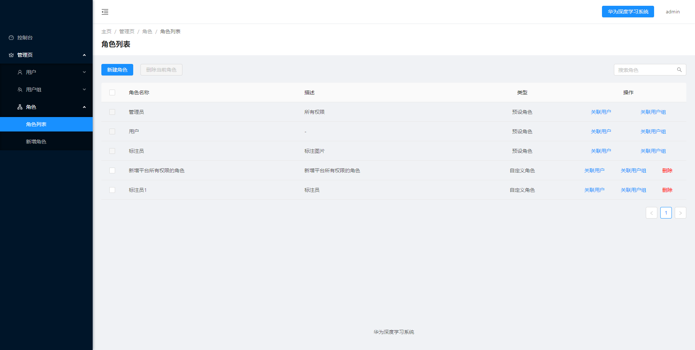
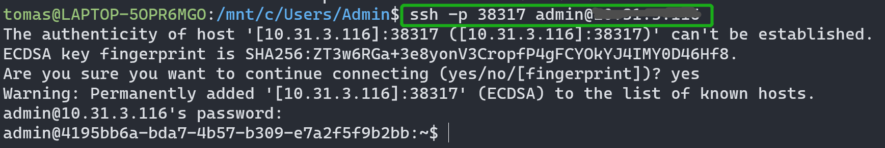

# 依瞳人工智能平台工业质检用户手册

* 文档说明

|属性         |时间       |
|-------------|-----------|
|文档版本     | 3.0.0     |
|发布日期     | 2021-04-06|

## 用户指南

在本文档中，您可以了解到用户在依瞳人工智能平台上，进行深度神经网络模型训练的操作方法，并且可以管理自己的训练任务、监控任务的执行情况、查看集群节点的运行情况等。
目标读者：深度学习算法工程师和业务开发者。

## 产品简介

### 产品概述

依瞳人工智能平台旨在为不同行业的用户提供基于深度学习的端到端解决方案，使用户可以用最快的速度、最少的时间开展高性能的深度学习工作，从而大幅节省研究成本、提高研发效率，同时可为中小企业解决私有化部署困难、成本高等问题。
平台提供了模型训练、代码开发、模型管理，数据管理，在线推理服务，资源监控，虚拟集群等开发环境，方便AI开发者快速搭建人工智能开发环境，开展AI开发应用。在监控模块基础上搭建预警模块，自动将平台异常通知管理员，提升平台的预警效率及安全性能。

### 名词解释

|术语/缩略语  | 解释|
|-------------|-----------------------------------------------------------------------------------------------------------------------------------------------------------------------------------|
|Tensorflow   | TensorFlow是一个分布式系统上的大规模深度学习框架。移植性好，可以运行在移动设备上，并支持分布式多机多卡训练，支持多种深度学习模型。
|PyTorch      | 不同于 TensorFlow，PyTorch 采用动态计算图的方式，提供良好的 Python 接口，代码简单灵活，使用起来非常方便。内存分配也经过了优化，能支持分布式多机训练。
|MindSpore    |MindSpore是端边云全场景按需协同的AI计算框架，提供全场景统一API，为全场景AI的模型开发、模型运行、模型部署提供端到端能力。
|Kubernetes   |简称K8S用于管理云平台中多个主机上的容器化的应用，目标是让部署容器化的应用简单并且高效，提供了应用部署，规划，更新，维护的一种机制。
|代码开发     |专家系统中模型训练任务。
|VC           |Virtual Cluster简称虚拟集群，对物理集群内所有AI计算芯片进行分组管理，就称为一个虚拟集群。
|设备类型     |可用于模型训练的计算资源，比如Nvidia GPU，Atlas NPU。
|设备数量     |可以分配给训练任务使用的资源数量。
|镜像         |执行模型训练所需要的文件集合。
|Jupyter      |Jupyter Lab是一个支持运行多种编程语言的Web的交互式计算环境。方便进行算法代码编写，模型训练任务的提交，和调试等操作。
|SSH          |便捷的SSH链接，可以访问到任务容器。
|TensorBoard  |一个可视化工具，它可以用来展示网络图、张量的指标变化、张量的分布情况等。在训练网络的时候，我们可以设置不同的参数（比如：权重W、偏置B、卷积层数、全连接层数等），使用TensorBoard可以很直观地进行参数的选择。

## 功能简介
本文主要介绍平台的功能和使用，包括用户资源分配、用户账号和权限管理、代码开发、虚拟集群管理、用户管理、模型训练和数据管理等。用户通过web端提交模型训练任务，在概览页面可查看任务的运行状态、在资源监控页面可以实时的了解资源使用情况、训练任务的日志输出等；通过集群状态监控可查看整个集群的资源使用情况，并可监控各物理节点的状态。

## 概述

本手册介绍如何进行TensorFlow、MindSpore模型训练，TensorFlow框架版本为1.15，MindSpore框架版本为1.0.1。

模型训练的流程如图所示。

###  项目管理
工业质检

工业质检是实现在工业制造中对产品缺陷的识别及分类，主要应用于电子产品制造、机械装备制造等领域，赋能工业质检和巡检场景，内置器件错漏反、OCR识别、异物检测 胶体检测等场景，提供从数据采集、数据标注、模型开发、模型发布、模型部署、质检应用的一体化解决方案，帮助客户实现智能制造及工业4.0时代的产业升级，提升效率。、

###  数据管理

###  运维管理

用户管理系统
============

用户管理系统页面如图所示，包括上方菜单栏、控制台和管理页，其中管理页包括用户、用户组、角色。

控制台
------

显示已有的用户数、用户组数和角色数，点击创建用户后即可快捷跳转到新建用户界面；点击创建用户组后即可快捷跳转到新建用户组页面；点击新建角色后即可快捷跳转到新建角色页面。

图84：控制台

管理页
------

包括用户、用户组和角色。用户包含用户列表和新建用户，用户组包含用户组列表和新建用户组，角色包含角色列表和，新建角色。只有管理员才可以访问和管理用户，用户组和角色权限；
管理员可以给用户关联角色限制其在平台的访问权限。

### 用户

#### 用户列表

用户列表展示已有的用户账号，点击【新建用户】可创建新的用户账号。用户列表中包括用户名、昵称、电话、电子邮件、操作共5列。

用户名：用户名，该字段是唯一的，不能重复；

昵称：用户昵称；

电话：电话号码；

电子邮件：邮箱；

操作：操作列，包括编辑用户的角色、将用户关联到用户组和删除用户操作。

系统默认配置的管理员账号： admin
，只允许修改密码，不允许删除，也不允许修改其角色。新建的其他管理员账号是允许修改和删除的。

点击列表中的用户名或昵称可跳转到用户详情页。

#### 新建用户

创建用户时共分为3步，填写用户信息-\>关联角色-\>确认。

昵称和用户名为必填字段，填写之后点击下一步，跳转到关联角色页面。也可以批量添加用户，最大数量不能超过10个。

图88：新建用户-关联角色

关联角色时，至少需选择一个角色关联，点击下一步后跳转到预览页面，也可点击上一步返回上一步。

图89：新建用户-确认

展示新建用户的相关信息，点击提交则新建用户，点击上一步则返回上一步。

### 用户组

包括用户组列表和创建用户组，用户组列表展示已有的用户组列表，点击创建用户组可创建新的用户组。

#### 用户组列表

用户组列表中包括用户组名称、描述、创建时间、操作共4列。

图90：用户组列表

用户组名称：该字段是唯一的，不能重复；

描述：用户组的描述；

创建时间：用户组的创建时间；

操作：操作列，可以为用户组添加用户和删除用户组。

点击列表中的用户组名称后跳转到用户组详情页面，显示用户组信息、用户组拥有的角色和用户组内的用户。

图91：用户组详情页

#### 新建用户组

创建用户时共分为3步，填写用户组信息-\>关联角色-\>确认。

图92：新建用户组-用户组信息

用户组名称和描述都为必填字段，填写后点击下一步，跳转到关联角色页面。

图93：新建用户组-关联角色

至少需选择一个角色关联，点击下一步后跳转到确认页面，也可点击上一步返回上一步。

图94：新建用户组-确认

展示新建的用户组相关信息，点击提交新建用户组，点击上一步返回上一步。

### 角色

包括角色列表和新增角色，角色列表展示已有的角色列表，点击新建角色可创建新的角色。

#### 角色列表

角色列表中包括角色名称、描述、类型、操作共4列。

图95：角色列表

角色名称：该字段是唯一的，不能重复；

描述：角色的描述；

类型：角色的类型，角色类型分为预设角色和用户自定义角色两种。预设角色是系统默认创建的，不能删除；

操作：操作列，可以进行关联用户、关联用户组和删除角色的操作。

#### 新建角色

创建角色时共分为3步，填写角色名称-\>描述-\>选择权限。

图96：新建角色

平台的权限共分为两种：

高效能平台：依瞳人工智能平台的所有权限，包括标注平台的权限，但不包括用户管理系统的权限；

标注平台：只能标注图片。

专家系统
========

专家系统沿用原来的开放平台的基础上，支持了vscode组件，支持中文，完善了优化了平台。用户可以在平台登录连接上拼接隐藏URL\`/expert\`，访问专家系统，例如：http://xx.xx.xx.xx/expert

登录专家系统
------------

点击右上角的【系统导航】中的【专家系统】。

图97 登录专家系统

查看集群状态
------------

进入【首页】，可以查用户使用的VC的资源使用状态。

图98 查看集群状态

自定义创建任务
--------------

创建任务的基本要素/名词

  **名词**          **说明**
  ----------------- ----------------------------------------------------
  Job               训练任务
  Cluster           资源集群名称
  Job Type          任务类型：为单机多卡，多机分布式
  Device Type       设备类型：x86-64 GPU, ARM64 NPU
  Preemptible       是否允许资源被抢占，默认为：NO，不允许被抢占
  Docker Image      容器，支持本地镜像和docker hub公共镜像，私有镜像库
  CMD               启动容器后可执行的命令，默认是bash shell
  Virtual Cluster   虚拟用户资源组
  Edge Inference    在线边缘推理，支持输出转换

参考预置模板自定义训练参数，然后点击【提交】就创建了新的训练任务/环境。

图99 创建任务

创建预置模板
------------

为便于其他同事、老师和同学使用，可以根据平台当前支持的环境配置训练任务的示例。保存为便于重复使用的模板【模板】。

图100 创建模板

使用模板创建任务
----------------

选择【Job Template】下拉菜单中已经预置的模板。

图101 使用模板创建任务

查看任务基本信息
----------------

提交训练任务后，界面会有任务的状态提示窗，在【查看/管理任务】页面的【简介】栏内能够查到任务的详细配置。

图102 查看训练任务详情

管理训练任务状态
----------------

平台支持启动，暂停，停止任务的操作。

其中暂停【Pause】操作支持模型创建了checkpoint的情况下，暂停后仍可继续执行训练；但训练环境是销毁后重建的，所以暂停并不支持保留环境，如需要保留环境，建议备份或保存使用的容器镜像。

注意：普通用户只能管理【我的任务】窗口的任务，只有管理员才可以管理【所有任务】窗口的所有任务。

图103 管理训练任务状态

查看训练任务日志
----------------

在任务详情中【控制台】可以分页查看模型训练日志；包含：创建用户环境，配置网络，导入训练环境变量，拉起镜像，调用训练脚本等，和AI框架，模型训练的全部log，都有相关的Tag提示。

须注意：
单机多卡任务log，多节点分布式任务log是按节点，卡的循序打印的；例如2卡的Job
,会先打印卡1的log，在打印卡2
的log。主要原因是NPU驱动是通过多线程调用多卡的，在配置resnet50示例时也是可以看到这样的设计规则的。

图104 查看训练任务日志

在【NPU
控制台】栏下可以查看NPU相关的错误日志；该窗口是将主机下\`/var/log/npu/slog\`目录下·host·相关log的EEROR条目过滤并展示出来。

由于NPU产品线还不支持独立输出用户所用的device的日志；目前我们是将训练任务（Job）占用NPU的所有日志输出；在问题定位的时候，可以结合【控制台】下调用模型训练时打印出来的Device
Id, 与【NPU 控制台】错误日志中的Device Id对比查看。

图105 查看NPU训练任务日志

查看资源使用状态
----------------

在任务详情的【指标】中可以查看当前Job 资源使用状态。

图106 查看资源使用状态

交互式调试训练任务
------------------

在任务详情的【端口】中可以打开Jupyter, ssh，tensorboard 交互式客户端。

图107 交互式调试方式

普通用户打开Jupyter 要进入\`/home\`目录下才有读写和执行权限。

图108 Jupyter 调试窗口

\`ssh -i /dlwsdata/work/admin/.ssh/id\_rsa -p 49572 admin\@10.31.3.116
\[Password: tryme2017\]
\`该链接默认带了主机下的key，和登录密码；如果需要在其他终端（网络可达）链接ssh,
需要去掉ssh key，即可，如：\` ssh -p 49572
<admin@10.31.3.116%60>然后输入密码：\`tryme2017\`

图109 终端SSH登录任务环境

Tensorboard
是一个可视化日志服务，预置resnet50模型已经配置好了输出log路径，但如果是自定义模型，则需要根据提示配置好log路径。

图110 使用Tensorboard分析训练日志

常见问题处理
============

Jupyter Lab交互式开发
---------------------

在"/home/\<USERNAME\>"目录下支持文件上传下载，脚本执行，远程terminal。

需注意如果是NPU相关训练，npu\_bridge要求在root权限下执行，建议使用
\`sudo su\`切换到root环境，如下图所示：

当前版本平台已经预先将常用的环境变量预置到root
和登录的用户环境下了，减少一些环境变量配置的困扰。

如果既不是登录用户，也不是root；那么可以手工加载" source
/pod.env"，就会将常用的tensorflow,
npu相关的环境变量加载到训练环境中。如下图所示：

在专家系统中自定义容器仓库
--------------------------

在提交任务窗口【提交训练任务】页面的高级选项【高级】下的选项【自定义
Docker
Registry】下可以添加自定义的容器仓库，仅支持HTTPS链接。如下图所示：

平台NPU资源调度策略
-------------------

对于NPU类型Job：

提交regular Job类型Job，设备num限制还是0，1，2，4，8。

提交distribute Job类型Job，NPU的distribute
Job类型，每个node的设备数量（num of per
device）还是默认8卡。Node数量最高要限制为节点的总和。

其中对于一个节点：0\~3卡为一组，4\~7卡为一组，Job
分配的资源不能跨组（例如：不支持3,4卡分配到一个Job）。

