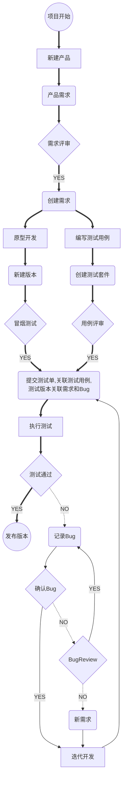

禅道提交测试单
======================================================================================
在禅道管理测试用例，主要在于提交测试单这个环节！也即是版本迭代的流程管理。

目前项目版本测试频繁，但是版本质量不好，测试的范畴，和测试质量需要一个有效的管理方式，核心在于测试用例流程管理！

* 禅道上测试用例分为两类：关乎项目产品的测试用例，和公共测试用例；测试用例可以通过测试套件管理。

* 测试用例的输入有2个，一是需求，二是发现的Bug；这两者关乎版本，关系于产品需求和项目管理状态。

* 对于某次版本测试，提交测试单，关联测试的版本，和需执行的测试用例，测试周期

* 执行完测试单中的测试用例，会产生Bug和相关测试结果

**禅道测试用例管理暨项目版本测试流程图：**

*如果流程图不能正常显示，请参考[禅道提交测试单流程图](../../images/testflow/禅道提交测试单.md)*

操作如下：
--------------------------------------------------------------------------------------

1. 新建项目，及项目产品

2. 创建测试版本

   **PM 创建提交测试的版本，发布的版本**

3. 项目版本关联需求和需验证的bug

    * PM 或产品经理需要将已实现，或完成的需求关联*测试版本*
    * 开发者需要将已解决的Bug关联到*测试版本*；也可在解决Bug时将解决版本设置为*测试版本*

    
    
    

4. 提交测试单关联测试版本

    

    

5. 新建测试用例，并管理测试用例套件

    

    

6. 测试单关联测试用例

    

7. 执行测试单

    

8. 执行失败测试用例转Bug

    **测试单的用例执行需在起周期内，才可导出有效完整的测试报告数据。**

    

9. 导出测试报告

    

    

10. 相关测试用例管理提议

    * 可以通过测试套件关联测试单的版本，管理或记录改版本的测试用例
    * 所有测试用例都可以在禅道中记录
        - 当前其中压力稳定性，或接口测试脚本也可以建立相同的“测试用例” 用来追踪执行结果
        - 可以通过测试套件分类管理测试用例
        - 可以抽取，独立出公共测试用例套件
        - 测试用例只增加不修改，不删除
        - *测试用例编写规范另行讨论*

另外： 我们需制定：

1. 提交测试准入清单
2. 提交安装部署准入清单

**附件：**

1. [模型训练测试—v1.0测试报告](https://apulis.zentaopm.com/testreport-view-4-product.html)